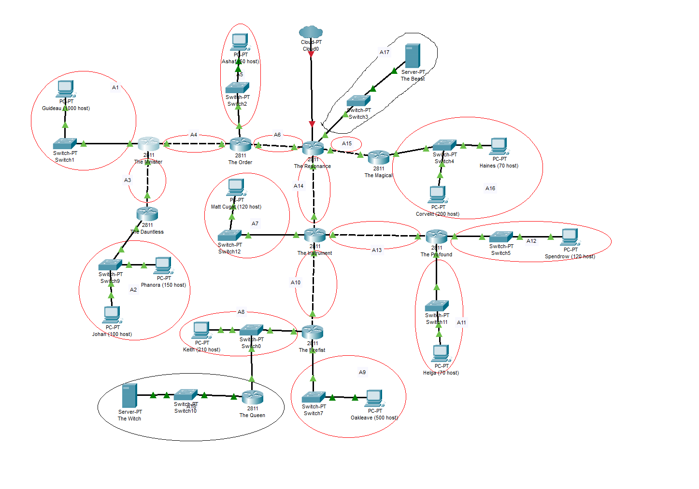
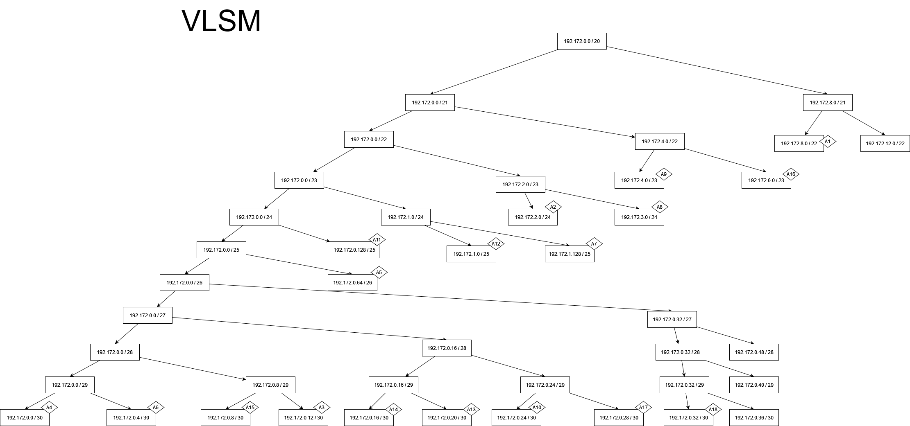
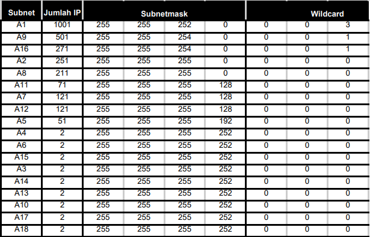
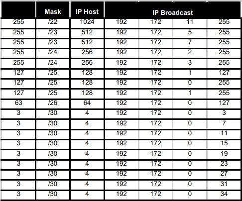

# Jarkom-Modul-4-A07-2022

## Anggota Kelompok

- I Putu Bagus Adhi Pradana (5025201010)
- Izzati Mukhammad (5025201075)
- Muhammad Damas Abhirama (5025201271)

## Pembagian Subnet
Membuat topologi seperti berikut pada cisco packet tracer

## VLSM

## Perhitungan IP
Menentukan jumlah alamat IP yang dibutuhkan oleh tiap subnetdan melakukan labeling pada netmask bedasarkan jumlah ip yang dibutuhkan.

